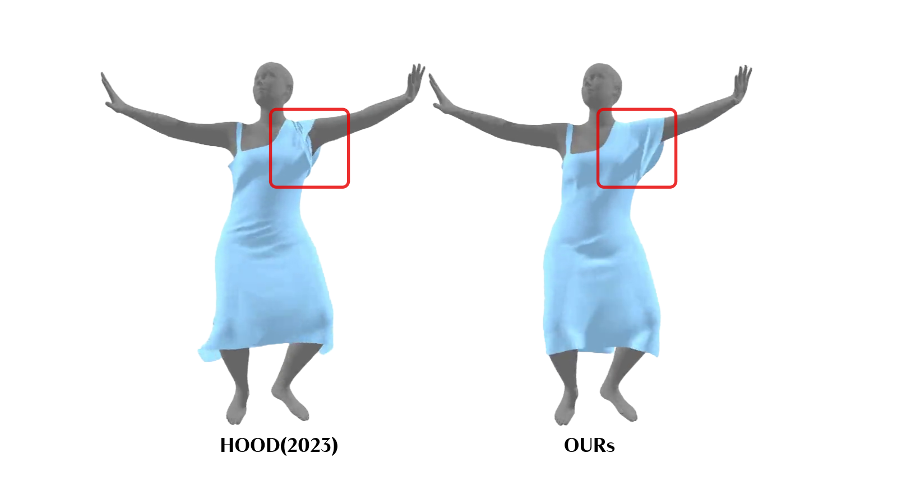
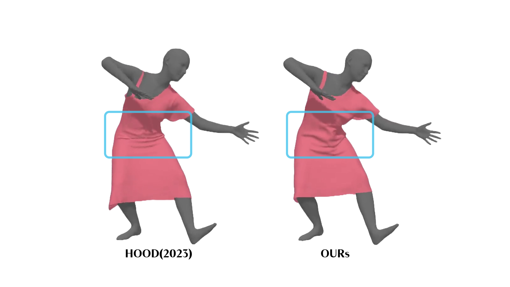

# Self-Collision_Aware_Dynamic_Cloth_Simulation
**An enhancement of the HOOD architecture that introduces a novel self-collision penalty mechanism to produce physically realistic, intersection-free garment dynamics.**
---

## 🧐 The Problem
Graph-based neural simulators like **HOOD (CVPR 2023)** are excellent at handling collisions between the cloth and the human body. However, they often struggle with **Self-Collisions**—instances where the cloth intersects with itself.

This limitation causes significant visual artifacts, such as:
* **Interpenetration:** Sleeves passing through the torso or each other.
* **Volume Collapse:** Loose garments (like hoodies or skirts) losing their volume during complex movements.
* **Unrealistic Folding:** Fabric appearing to "ghost" through itself rather than stacking or folding naturally.

**The Goal:** To bridge the gap between efficient deep learning architectures and physical realism by strictly enforcing intersection-free behavior.

---
## 💡 The Solution
This project extends the HOOD framework by integrating a **Differentiable Cubic Barrier Penalty**. 

Instead of relying solely on cloth-body constraints, this approach introduces a dense, pairwise collision module that:
1.  **Detects** close-range interactions between non-adjacent cloth vertices.
2.  **Penalizes** these interactions using a cubic loss function, which provides smooth gradients for optimization.
3.  **Resolves** intersections without altering the core graph message-passing architecture of HOOD.

The result is a simulation that respects the physical volume of the garment, even during high-contact poses like arm-crossing or twisting.

---
## 📸 Results & Comparison

*Testing performed on the AMASS (CMU) dataset.*

### 1. Sleeve Folding & Arm Crossing
**The Issue:** In the baseline model, the sleeve mesh often clips through the torso or the other arm.  
**Our Result:** The self-collision penalty forces the fabric to rest *against* the surface, preserving the sleeve's volume.

**Baseline (HOOD) vs Ours (Self-Collision Aware)** 
 
*Sleeve penetrates torso* *Intersection prevented via repulsion* 

### 2. Torso Twisting & Volume Preservation
**The Issue:** During twisting motions, loose garments tend to collapse inward.
**Our Result:** The enhanced model maintains the garment's structural integrity and thickness.

**Baseline (HOOD) vs Ours (Self-Collision Aware) **
 
*Cloth collapses under twist* *Volume and continuity maintained* 
---
### 🎥 Simulation Results
*Click the links below to watch the simulation videos:*

* **[▶️ Watch: Sleeve Folding & Arm Crossing](results/res%20%286%29.mp4)** *Demonstrates the self-collision penalty preventing the sleeve from clipping through the arm.*
* **[▶️ Watch: Torso Twisting Demo](results/res%20%285%29.mp4)** *Shows how volume is preserved during complex upper body movements.*

---
## 🚀 Key Features
* **Intersection-Free:** Significantly reduces cloth-to-cloth penetration artifacts.
* **Physically Plausible:** Preserves garment thickness and volume during complex animations.
* **Architecture Agnostic:** The penalty module is integrated without changing the underlying GNN structure.
* **Differentiable Physics:** Uses a cubic barrier loss ($\mathcal{C}^1$ continuous) ensuring stable gradient-based learning.

---
## 🛠️ Tools & Technologies
* **Base Architecture:** HOOD (Hierarchical Graphs for Generalized Modelling of Clothing Dynamics)
* **Dataset:** AMASS (Archive of Motion Capture as Surface Shapes) & VTO.
* **Hardware:** Trained on NVIDIA RTXA4000 with 16GB VRAM

---

## 🎓 Acknowledgments
This project was carried out as an internship project at the **Center of Excellence in Visual Intelligence (CEVI)**, KLE Technological University, Hubballi.

* **Submitted by:** G. Gyaneshwar Rao
* **Mentors:** * Dr. Uma Mudenagudi (Head of CEVI)
    * Prof. Ramesh Ashok Tabib

---

*Note: This repository showcases the results and methodology of the project. For the original HOOD architecture, please refer to the [original paper/repository](https://github.com/Dolorousrtur/HOOD).*
